# 各种服务看看

- Amazon EC2 (Amazon Elastic Compute Cloud)
    - > 云中的虚拟服务器
- Amazon Simple Storage Service（S3）
    - > 云中的可扩展存储
- Amazon Aurora
    - > 高性能托管式关系数据库，可完全兼容 MySQL 和 PostgreSQL。
- Amazon DynamoDB
    - > 托管型 NoSQL 数据库
- Amazon RDS
    - > 适用于 MySQL、PostgreSQL、Oracle、SQL Server 和 MariaDB 的托管型关系数据库服务
- AWS Lambda
    - > 无需考虑服务器即可运行代码
- Amazon VPC
    - > 隔离型云资源
- Amazon Lightsail
    - > 启动和管理虚拟专有服务器
- Amazon SageMaker
    - > 大规模构建、训练和部署机器学习模型

# Cloud Practitioner

- 考试时长 90 分钟，65 道题单选或多选
- 伦敦考点时间槽多
- 官方备考资源 https://aws.amazon.com/cn/certification/certified-cloud-practitioner/?c=sec&sec=resources
    - 官方教程视频 [AWS Cloud Practitioner Essentials](https://explore.skillbuilder.aws/learn/course/external/view/elearning/134/aws-cloud-practitioner-essentials)
    - 官方教程视频中文版 [AWS Cloud Practitioner Essentials (Simplified Chinese) (Na) (中文讲师定制版)](https://explore.skillbuilder.aws/learn/course/external/view/elearning/13600/AWS-Cloud-Practitioner-Essentials-Simplified-Chinese-Na-%E4%B8%AD%E6%96%87%E8%AE%B2%E5%B8%88%E5%AE%9A%E5%88%B6%E7%89%88-)
- [AWS Certified Cloud Practitioner Certification Course (CLF-C01) - Pass the Exam! - freeCodeCamp - YouTube](https://www.youtube.com/watch?v=SOTamWNgDKc)

考点分布：

- 云概念（计分内容的 24%）
- 安全性与合规性（计分内容的 30%）
- 云技术和服务（计分内容的 34%）
- 账单、定价和支持（计分内容的 12%）

学习笔记

脑图（建设中）

```mermaid
mindmap
(AWS 各服务)
    计算
        Elastic Compute Cloud (EC2)
            EC2 定价：
                按需实例 OnDemand Instances
                预留实例 Reserved Instances
                EC2 实例 Savings Plans：作出每小时支出承诺
                Spot 实例 Spot Instances
                专用主机 Dedicated Hosts
            Amazon EC2 Auto Scaling
            Elastic Load Balancing 
            EC2 Amazon Machine Images （AMIs） 灾难恢复
        Amazon Simple Queue Service (SQS)
        Amazon Simple Notification Service (SNS)
        无服务器计算 AWS Lambda：FaaS
        容器
            Amazon Elastic Container Service (Amazon ECS)
            Amazon Elastic Kubernetes Service (Amazon EKS)
            无服务器 AWS Fargate
    全球基础设施
        区域（Region）
            可用区（Availability Zone）
        边缘站点
            Amazon CloudFront：CDN
            Amazon Route 53：域名服务
            AWS Outposts：本地数据中心使用AWS服务
        预置AWS资源
            与AWS交互：WS管理控制台、AWS、命令行界面（CLI）、AWS开发工具包（SDK）、Access keys（访问密钥）
            AWS Elastic Beanstalk：部署应用程序，PaaS
            AWS CloudFormation：定义基础设施，IaC
                可以利用 AWS Cloud Development Kit (AWS CDK)
    联网
        Virtual Private Cloud （VPC） 虚拟私有网
            AWS Direct Connect：用于企业数据中心与VPC之间
        子网 Subnet
        Network ACL（网络访问控制列表）：子网级别
        安全组（Security groups）：EC2实例级别
        AWS Transit Gateway：连接多个VPC以及本地数据中心，易扩展
    存储
        实例存储 Instance Store
        Amazon Elastic Block Store (Amazon EBS)
            Amazon EBS snapshots
        Amazon Simple Storage Service (Amazon S3)
            存储类
                Amazon S3 Standard
                Amazon S3 静态网站托管
                Amazon S3 Standard一IA (不频繁访问存储，Infrequent Access)
                S3 One Zone一Infrequent Access
                S3 IntelligentTiering
                S3 Glacier Instant Retrieval
                Amazon S3 Glacier Flexible Retrieval
                S3 Glacier Deep Archive
                S3 Outposts：本地
                S3生命周期策略
            Amazon Macie：发现和保护S3敏感数据
        Amazon Elastic File System (Amazon EFS)
    数据库
        Amazon Relational Database Service (Amazon RDS)
            Aurora
        DynamoDB：NoSQL
        Amazon Redshift
        AWS Database Migration Service
            AWS Schema Conversion Tool
        其他数据库服务
            Amazon DocumentDB
            Amazon Neptune：图
            Amazon Quantum Ledger DataBase (Amazon QLDB)
            Amazon Managed Blockchain
            Amazon ElastiCache
            Amazon DynamoDB Accelerator (DAX)
        其他相关服务
            Amazon Athena：数据分析，偶尔
            Amazon Kinesis：实时数据流分析
    安全
        责任共担模式
            客户：云中
            AWS：云本身
        AWS Identity and Access Management (IAM)
            IAM 用户
            IAM 策略
            IAM 组
            IAM 角色
            多重身份验证（MFA）
            IAM credential report（IAM凭证报告）
            AWS IAM Access Analyzer
        AWS Organizations
            组织单位（OU）
        AWS Security Token Service (AWS STS)
        合规
            AWS Artifact
            Customer Compliance Center
        拒绝服务攻击（DoS）
            AWS Shield Standard
            AWS Shield Advanced
        其他安全服务
            加密
                静态加密
                    AWS KMS
                传输中加密：如SSL
            AWS Key Management Service (AWS KMS)
            AWS WAF (Web Application Firewall)
            Amazon Inspector
            Amazon GuardDuty
            AWS Security Hub
    监控和分析
        Amazon CloudWatch
        AWS CloudTrail
        AWS Trusted Advisor
            五个支柱：成本优化、性能、安全性、容错能力、服务限制
    定价和支持
        账单控制面板
        整合账单 Consolidated Billing
        AWS Budgets（预算）
        AWS Cost Explorer
        AWS Support 计划
            Basic、Developer、Business、Enterprise OnRamp、Enterprise
        AWS Marketplace
    迁移和创新
        AWS Cloud Adoption Framework （AWS CAF） 云采用框架
            六大核心视角
                业务 Business
                人员 People
                监管 Governance
                平台 Platform
                安全 Security
                运维 Operations
        迁移策略
            7个关键因素（7 R）（7个不同的方案也）
                重新托管 Rehost (lift and shift)
                搬迁（虚拟机管理程序级别的提升和移动）Relocate (hypervisorLevel lift and shift)
                更换平台 Replatform (lift and reshape)
                重新购买 Repurchase (drop and shop)
                重构 重新设计架构 Refactor reArchitect
                保留 Retain (revisit)
                停用 Retire
        AWS Snow 系列
            AWS Snowcone
            Snowball Edge Storage Optimized
            Snowball Edge Compute Optimized
            AWS Snowmobile
        创新
            机器学习 ML
                Amazon SageMaker
                Amazon Augmented AI (Amazon A2I)
            人工智能 AI
                Amazon CodeWhisperer
                Amazon Transcribe
                Amazon Comprehend
                Amazon Fraud Detector
                Amazon Lex
                Amazon Textract
                AWS DeepRacer
            VMWare on AWS
            AWS Ground Station 卫星
    云之旅
        AWS WellArchitected Framework
            六大支柱（pillars）：越安靠Arn性成续Cae3
                卓越运营 Operational Excellence
                安全性 Security
                可靠性 Reliability
                性能效率 Performance Efficiency
                成本优化 Cost Optimization
                可持续性 Sustainability
            AWS WellArchitected Tool 
        云计算的六大优势
            将前期费用转变为可变支出。
            实现大规模经济效益。
            无需猜测容量。
            提高速度和敏捷性。
            不再花费资金来运行和维护数据中心。
            数分钟内实现全球化部署。
    99 其他服务拾遗
        Amazon AppStream 2.0
        Amazon WorkSpaces
        AWS CloudShell
```

- 1 Amazon Web Services 简介
- 2 云中的计算
    - `Elastic Compute Cloud (EC2)` 实例类型
        - 通用 General purpose
            - （计算、内存和联网资源的平衡）
        - 计算优化型 Compute optimized
            - （高性能处理器）
            - （适合用于批处理工作负载）
        - 内存优化型
        - 加速计算 Accelerated computing
            - （使用硬件加速器。适合**图形处理**等）
        - 存储优化型 Storage optimized
    - EC2 定价（购买选项）
        - `按需实例 On-Demand Instances`
            - 例：每年临时执行2个月者即适用，而不适用下面长期者
            - **按分钟收费**，不足一分钟按一分钟
        - `预留实例 Reserved Instances`：针对账户中的按需实例提供账单折扣，可以**1年期或3年期**
            - 标准预留实例：要求指定：实例系列和大小、平台描述、租赁、区域
            - 可转换预留实例
            - Convertible Reserved Instances 适用于需要更大的灵活性相比于 Standard Reserved Instances
        - `EC2 实例 Savings Plans`：对实例系列或区域**作出每小时支出承诺**且**期限1或3年**，承诺范围内的使用享折扣
            - 与预留实例不同的是，无需预先制定EC2实例类型和大小（如m5.xlarge）、操作系统以及租赁类型
        - `Spot 实例 Spot Instances`：使用闲置的EC2计算容量，故便宜，适合启动和结束时间灵活或能承受中断者
            - 好像都是无状态的
        - `专用主机 Dedicated Hosts`：EC2实例容量**完全供您专用**的物理服务器。最贵
            - 例：用户想使用其 per-core per-虚拟机 per-socket 之类的软件证书给 AWS 运行的主机
            - 与之对比，Dedicated Instances 不是把物理硬件专用，而是共享硬件
        - （生词： upfront commitment 提前承诺，就是说想预付）
    - Amazon EC2 Auto Scaling：可扩展性
        - 可扩展性：响应不断变化的需求
        - （横向扩展。而纵向是指把单个服务器变大）
        - 可以使用两种扩展方法
            - 动态扩展
            - 预测性扩展：根据预测的需求
        - 配置选项
            - 最小容量
            - 所需容量（默认等于最小）
            - 最大容量
    - 利用 Elastic Load Balancing 引导流量（负载均衡）
        - `Elastic Load Balancing (ELB)`、Network Load Balancer、Application Load Balancer **都是跨可用区**而不是跨区域的。如果想跨区域，请使用 AWS Global Accelerator
    - 灾难恢复 disaster recovery
        - `EC2 Amazon Machine Images (AMIs)` 允许您创建EC2实例的镜像，这些镜像包括操作系统、应用程序和数据。您可以使用AMIs来备份和还原EC2实例，以进行灾难恢复。
            - `EC2 Image Builder`允许您自动化创建、维护和部署自定义Amazon Machine Images（AMI）的过程，用于您的EC2实例
        - `Amazon Elastic Block Store (Amazon EBS) snapshots` 允许您创建Amazon EBS卷的备份。这些快照可用于还原数据或创建新的Amazon EBS卷，以进行数据恢复和灾难恢复。
    - 消息收发和队列（以实现松耦合）（服务：SNS、SQS）
        - Amazon Simple Queue Service (SQS) 使用消息队列的方式（缓冲）
        - Amazon Simple Notification Service (SNS) 使用发布/订阅模式（所以适合群发）
        - 整体式应用程序是紧耦合，害怕单个组件的故障；微服务是松耦合，SNS SQS 即是帮助之
    - 其他计算服务
        - 无服务器计算 AWS Lambda
            - “无服务器”一词是指您的代码在服务器上运行，但您无需预置或管理这些服务器
            - 属于 函数即服务（FaaS），他司产品：Google Cloud Functions、Microsoft Azure Functions、Vercel（提供FaaS与静态网站托管）
        - 容器化
            - 容器可为您提供一种标准方法，将应用程序的代码和依赖项打包到单个对象中。您还可以将容器用于对安全性、可靠性和可扩展性有基本要求的流程和工作流。
            - 提供容器编排的服务：
                - Amazon Elastic Container Service (Amazon ECS)
                - Amazon Elastic Kubernetes Service (Amazon EKS)
        - 适用于容器的无服务器计算引擎 AWS Fargate
        - `AWS Step Functions`是一项AWS云计算服务，用于协调和自动化多个AWS服务之间的工作流程。它允许您创建、运行和协调分布在不同AWS服务之间的应用程序组件，从而构建具有复杂业务逻辑的分布式应用程序。
        - `AWS Batch` 是一种服务，允许开发人员、科学家、工程师和分析师在 AWS 上轻松有效地运行数百或数千个并行作业。AWS Batch 动态地根据提交的批处理作业的数量和特定资源需求，提供最优的计算资源数量和类型
- 3 全球基础设施和可靠性
    - `区域（Region）`：AWS全球基设之物理位置也，组成以可用区
        - 考虑因素：合规性、地理距离、功能可用性（有的新功能只在某些区域上线了）、定价
        - 区域范围的服务都是高度可用的（区域内部的更小分区是可用区，他们在地理上不相连，以使一个灾害不会影响区域里的多个可用区）
            - `可用区（Availability Zone）`是一个区域内的单个数据中心或一组数据中心。可用区彼此相距数十英里。这个距离足够近，可以在可用区之间实现低延迟（请求内容与接收内容之间的时间）。但是，如果区域内的某个部分发生灾难，这个距离又足够远，可以降低多个可用区受到影响的几率。
            - `区域`是包含 AWS 资源的地理区域。是在地理上隔离的地区。由三个或更多可用区组成。
    - 边缘站点：用来在靠近客户的地方缓存内容副本
        - AWS 上的 CDN 是 Amazon CloudFront
        - 边缘站点是与区域分开的
        - 边缘站点还支持域名服务，即 Amazon Route 53
        - 如果想在公司自己的数据中心使用 AWS 服务，可以使用 `AWS Outposts`，即在你的数据中心内安置一个隔离的迷你区域，归 AWS、 所有并 AWS 负责运维
            - **本地**而非混合云
    - 如何预置AWS资源
        - 与AWS服务交互：AWS管理控制台、AWS、命令行界面（CLI）、AWS开发工具包（SDK）、其他工具
            - `Access keys（访问密钥）`用于通过AWS CLI或AWS API进行编程访问AWS资源，由Access Key ID和Secret Access Key组成
        - `AWS Elastic Beanstalk`
            - 用它，您只需负责提供代码和配置设置，Elastic Beanstalk 会负责部署执行以下任务所需的资源：
                - 调整容量
                - 负载均衡
                - 弹性伸缩
                - 应用程序运行状况监控
            - （是故部署迅速，无需手动创建资源）
            - 属于 **平台即服务（PaaS）**（对比 AWS Lambda 是 FaaS），对应他司产品：Heroko、Google App Engine
        - `AWS CloudFormation`
            - 借助 AWS CloudFormation，您可以将基础设施视为代码（基础设施即代码 IaC）。这意味着您可以通过编写代码来构建环境，而不是使用 AWS 管理控制台来单独预置资源。
            - AWS CloudFormation 能够以安全、可重复的方式预置资源，让您可以频繁构建基础设施和应用程序，而无需执行手动操作。它可以确定管理堆栈时要执行的适当操作，并在检测到错误时自动回滚更改。
            - 可以利用 AWS Cloud Development Kit (AWS CDK)
        - （好像是 CloudFormation 定义基础设施，Elastic Beanstalk 部署应用程序？）**记忆：PaaS和Beanstalk关联嘛，清浊音的区别；CloudFormation就是另外的**
    - 其他
        - `AWS Global Accelerator`是一项服务，它有助于实现高可用性的应用程序，能够在多个 AWS 区域 (Multi-Region) 和可用区 (Multi-AZ) 架构中实现快速故障切换 (fast failover)。AWS Global Accelerator 是一项用于提高应用程序可用性和性能的服务。它通过将流量引导到全球分布的 AWS 边缘位置和 AWS 区域中的终端节点来提高网络性能。这有助于降低延迟并提供更高的吞吐量，以改善用户体验。
        - `AWS Health Dashboard`提供了有关AWS服务当前状态和历史性事件的信息。它显示了AWS全球基础设施中的问题和事件，以及这些问题和事件对AWS服务的影响程度。用户可以在AWS Health Dashboard上查看服务的当前状态，以及是否存在任何与服务可用性或性能相关的问题。
- 4 联网
    - 与 AWS 的连接
        - Virtual Private Cloud (VPC) 虚拟私有网，在 AWS 资源周围建立边界
            - 里面可以包含子网
            - 可以建立互联网网关来允许互联网公共流量
            - 可以建立虚拟私有网关，虚拟私有网络（VPN）连接可以建立在VPC和企业内部网络之间
                - `AWS VPN（Virtual Private Network）`是一种专门用于建立安全的、加密的连接，以将本地数据中心与AWS云连接起来。它提供了一种安全的方式，使本地网络能够访问AWS云中的资源，同时确保数据在传输过程中得到保护和加密。这使得企业可以安全地扩展其本地基础设施到AWS云中，以满足不同的业务需求。
            - `AWS Direct Connect` 这个服务可以给企业数据中心和VPC之间建立专有的物理链路，通过 AWS Direct Connect 站点
                - 企业**本地**的数据中心叫 company’s **on-premises** data center
    - 子网和网络访问控制列表
        - 在 VPC 中，`子网 Subnet`是一个用于将资源归为一组的独立区域
            - 公有子网：包含需要能够公开访问的资源，例如在线商店的网站。
            - 私有子网：包含只能通过私有网络访问的资源，例如包含客户个人信息和订单历史记录的数据库。
            - 在 VPC 中，子网可以相互通信
        - `Network ACL（网络访问控制列表）`，**无状态**，**子网级别**。是一种虚拟防火墙，用于在子网级别控制入站和出站流量。
            - 检查出入子网的数据包的权限，这些权限可以表明数据包的发送者，以及数据包与子网中的资源进行通信的方式。
            - 默认情况下，您账户的默认网络 ACL **允许**所有入站和出站流量，但您可以通过添加自己的规则对其进行修改。自定义网络 ACL 会拒绝所有入站和出站流量，除非您添加规则，指定允许哪些流量。此外，所有网络 ACL 都具有显式拒绝规则。该规则可以确保拒绝不符合列表中的任何其他规则的数据包。
            - 像边检
            - 按顺序检验各规则，从 the lowest numbered，而不是所有规则都过一遍
        - `安全组(Security groups)`，**有状态**，**EC2实例级别**。可控制 Amazon EC2 实例的入站和出站流量。
            - 默认情况下，安全组拒绝所有入站流量并允许所有出站流量。您可以添加自定义规则来配置允许哪些流量，然后拒绝所有任何其他流量。
            - 像门卫
            - 多个 Amazon EC2 实例，您可以将它们与同一安全组关联，也可以为每个实例使用不同的
            - 有状态：当请求的数据包的响应返回实例时，安全组会记得，允许响应进入
            - 例：只允许通过特定 port 访问 EC2 实例
        - `VPC Flow Logs` 提供有关VPC中网络接口入站和出站流量的日志信息
    - `AWS Transit Gateway` 是一项服务，可用于构建高度可扩展的网络架构，用于连接多个VPC（包括将来可能增加的VPC）和连接本地数据中心到AWS云。它简化了网络连接管理，允许跨多个VPC进行路由和网络流量控制，以及在VPC数量增加时轻松扩展。故VPC多且欲渐增者可用。
    - `NAT gateway`可以用来允许 Amazon EC2 实例在私有子网中连接到互联网，以获取操作系统更新，同时阻止来自互联网的流量访问 EC2 实例。 NAT 网关充当一个网络地址转换 (NAT) 设备，它允许出站流量离开 EC2 实例，但不允许入站流量访问 EC2 实例。这确保了 EC2 实例的安全性。
    - 什么服务或特性可以**连接两个VPC**？VPC peering、AWS Transit Gateway
    - 全球联网
        - Amazon Route 53 是亚马逊的域名服务（DNS）
            - Route 53 的另一项功能是管理域名的 DNS 记录。您可以转移由其他域名注册商管理的现有域名的 DNS 记录。您也可以直接在 Route 53 中注册新域名。
            - 是**跨区域**的
        - AWS 上的 CDN 是 Amazon CloudFront，从边缘站点分发内容
- 5 存储和数据库
    - 存储解决方案
        - `实例存储 Instance Store`：是指EC2实例物理主机的磁盘存储，数据会在实例终止时丢失。故仅用于**临时数据**
        - `Amazon Elastic Block Store (Amazon EBS)`
            - 用来存`数据块`而且可以挂载到EC2（你的电脑硬盘就是 块存储）。与EC2的物理主机分开。
            - 支持以快照(`Amazon Elastic Block Store (Amazon EBS) snapshots`)形式增量备份
        - `Amazon Simple Storage Service (Amazon S3)`
            - 将数据存储为`对象`（可以是大型多媒体文件等），不挂载到EC2而是网络请求获取
                - 每个对象包含键、元数据、数据
            - 支持版本控制
            - 存储在`存储桶`中而不是文件目录
                - 可以创建多个存储桶，并将它们存储在不同的类
            - 最大对象5TB
            - **实惠**，相对于 EBS EFS Aurora 等，所以例如可存log。但是速率对于高可用、快恢复来说不够
            - 存储类
                - `Amazon S3 Standard`：11个9的持久性；多个副本保存在至少3个可用区；
                - Amazon S3 静态网站托管
                - `Amazon S3 Standard-IA (不频繁访问存储，Infrequent Access)`：不常访问，但要在需要时快速访问
                - `S3 One Zone-Infrequent Access`：存储在单个可用区，更便宜但怕故障
                - `S3 Intelligent-Tiering`：适合访问模式未知者，所**30天**未访问则移诸Standard-IA，访问了IA则移诸Standard
                - `S3 Glacier Instant Retrieval`：像Glacier Flexible Retrieval但检索速度快，数毫秒内，适用于需要立即访问
                - `Amazon S3 Glacier Flexible Retrieval`：不需要快速访问，归档数据
                    - 为了合规性可以用文件库锁定策略锁定，可以指定控制措施如一写多读（WORM）并锁定策略以防将来并编辑
                    - 可以直接上传焉，也可以使用S3`生命周期策略`
                    - 在**1分钟到12小时**内检索
                - `S3 Glacier Deep Archive`：成本最低的存储类，检索时间**12到48小时**，都复制存储至少3个可用区，适合每年可能访问一两次者
                - `S3 Outposts`：为您的本地 AWS Outposts 环境提供对象存储，适合具有本地数据驻留要求的工作负载，这些工作负载必须确保数据靠近本地应用程序，从而满足苛刻的性能需求。
                - S3`生命周期策略`：在层之间自动移动数据
            - `Amazon Macie` 是一项用于发现和保护存储在Amazon S3存储桶中的敏感数据的服务。它使用机器学习和自定义标识符来自动识别和分类敏感数据，并提供有关这些数据的可视化报告和警报，以帮助您管理和维护数据的安全性。
            - `S3 Multi-Region Access Points` 是一项 Amazon S3 服务的功能，它允许用户通过单个全局名称来访问多个 AWS 区域中的存储桶。这有助于简化跨多个 AWS 区域的数据访问，同时提供低延迟和高吞吐量。
            - `S3 Transfer Acceleration`允许您通过Amazon CloudFront的全球加速网络，以更快的速度上传和下载文件到S3存储桶。这有助于解决长距离传输所涉及的网络延迟问题，提供了更高的数据传输速度和更好的用户体验。
            - S3 Object Lock prevents S3 objects from being deleted or overwritten for a fixed amount of time or indefinitely.
            - S3 Inventory report：To keep track of objects and their respective tags, buckets, and prefixes, you can use an S3 Inventory report that lists your stored objects within an S3 bucket or with a specific prefix, and their respective metadata and encryption status.
        - 对比 EBS S3：
            - EBS：
                - 对象存储必须是整个对象，不支持增量更新，所以如何需要大量微小的编辑，适合EBS
            - S3 
                - 支持 Web，区域性分布，节省成本，无服务器，
        - `Amazon Elastic File System (Amazon EFS)`
            - 是一个托管文件系统
            - 多个实例可以同时访问EFS中的数据
            - 是真正的Linux文件系统
            - 区域性资源（多个可用区，而EBS只在单个可用区）
            - 会自动扩展（EBS不会）
            - 与块存储和对象存储相比，文件存储非常适合用于大量服务和资源需要同时访问相同数据的使用案例。
            - 支持NFS协议而不是SMB协议
        - `AWS Storage Gateway`是一个**混合云**存储服务，它允许用户将本地存储与云存储集成在一起。它提供了不同的存储接口，包括文件存储、卷存储和虚拟磁带库，使用户能够将其本地应用程序连接到云存储资源，从而实现对云中存储容量的扩展和备份。
            - `Tape Gateway` 磁带
            - `Volume Gateway` iSCSI（Internet Small Computer Systems Interface）存储卷，主要面向基于块存储的应用
            - `Amazon FSx File Gateway` 面向Windows文件系统
            - `Amazon S3 File Gateway` 支持标准文件存储协议（如NFS），存储为对象
            - 例：比如存储数据备份，存在云上，但本地cache
        - `Amazon FSx （Amazon FSx for Windows File Server）` 是 AWS 提供的一项托管文件存储服务，适用于 Windows 和 Linux 系统。对于公司需要一个完全托管的 Windows 文件服务器来支持其基于 Windows 的应用程序的情况，Amazon FSx 是一个理想的选择。它提供了高度可用的 Windows 文件系统，支持多个**协议（如 SMB（Server Message Block） 和 NFS（Network File System））**，并能够与 AWS 的其他服务集成，以便实现数据共享和备份等功能。
            - Win主要用SMB，Linux主要用NFS
            - Amazon FSx File Gateway可以**支持本地**设施访问这个文件系统
    - 数据库服务
        - `Amazon Relational Database Service (Amazon RDS)`
            - RDS 是托管性更高的数据库服务，有以下优势无需您自己管理：自动修补、备份、冗余、故障转移、灾难恢复
            - RDS 支持的数据库引擎：MySQL、PostgreSQL、Oracle、Microsoft SQL Server、MariaDB、Amazon Aurora
            - 其中 `Amazon Aurora` 托管性更强，兼容 MySQL PostgreSQL，成本是商业数据库的十分之一，支持跨设施复制数据6个副本，也支持15个只读副本，可以持续备份到S3，还有时间点恢复功能
                - 它的速度最高可达标准 MySQL 数据库的五倍，标准 PostgreSQL 数据库的三倍。
                - Amazon Aurora 通过减少不必要的输入/输出 (I/O) 操作，帮助您降低数据库成本，同时确保您的数据库资源保持可靠和可用。
                - 仲有无服务器版 `Amazon Aurora Serverless`
        - `Amazon DynamoDB`：非关系型（NoSQL），无服务器
            - 专用、完全托管、高度可扩展、毫秒级响应时间（比如扩展到每天最多处理 10 万亿个请求）
            - NoSQL：
                - 存储在一张表，通常是键值对，值里可以有不同的属性
                - 大部分场景下，就是用一张表，没用到关系型的复杂功能，徒增开销，此时非关系型更好
        - `Amazon Redshift`
            - 是一项**数据仓库**服务，可用于大数据分析。它让您能够从多个源收集数据，并帮助您了解数据中的关系和趋势。
            - 数据仓库适合过去数据分析，与实时更新的请求不同
        - AWS Database Migration Service
            - 在迁移期间，源数据库保持运行，减少了依赖该数据库的应用程序的停机时间。
            - 如果是迁移到异构的数据库，要首先使用AWS Schema Conversion Tool 进行转换
            - 除了把本地迁移到网上，还可以用于：
                - 迁移到开发和测试环境、数据库整合、持续复制
        - 其他数据库服务
            - Amazon DocumentDB
                - 是一项文档数据库服务，支持 MongoDB 工作负载。（MongoDB 是一个文档数据库程序。）
                - 比如想要存的不只是 DynamoDB 那种小的数据，而是内容资料等
            - Amazon Neptune
                - 是一项图数据库服务。
                - 您可以使用 Amazon Neptune 构建和运行使用高度互联数据集的应用程序，例如推荐引擎、欺诈侦测和知识图谱。
            - `Amazon Quantum Ledger DataBase (Amazon QLDB)`
                - 是一项分类账数据库服务。
                - 您可以使用 Amazon QLDB 查看对应用程序数据进行的所有更改的完整历史记录。
                - 是一个不可变记录系统，其中的所有记录都不能删除。有时，你实现这种需求或许不希望使用区块链，区块链会添加一个巨大的分散化组件，并不是财务监管机构希望看到的
            - Amazon Managed Blockchain
                - 可以让您通过开源框架创建和管理区块链网络。
            - Amazon ElastiCache
                - 可在数据库上添加缓存层，有助于缩短常见请求的读取时间。
                - 它支持两种类型的数据存储：Redis 和 Memcached。
            - Amazon DynamoDB Accelerator (DAX)
                - 是一种适用于 DynamoDB 的内存中的缓存。
                - 它有助于将响应时间从个位数毫秒级缩短到微秒级。
            - Amazon Timestream 是一项专门用于处理时间序列数据的托管数据库服务，可帮助您轻松存储和分析大规模的时间序列数据，例如传感器数据、日志、度量值等。它具有内置的时间序列函数和查询功能，使您能够有效地处理和分析大量时间序列事件。
        - 其他相关服务
            - `Amazon Athena`：完全托管的云数据分析服务，可分析S3中的，大规模数据，只需支付查询成本而不用持续运行，适于**偶尔查询**
            - `Amazon Kinesis`：用于**实时数据流**处理和分析
            - `Amazon EMR （Amazon Elastic MapReduce）` 是一项托管的大数据处理服务，用于处理和分析大规模数据集
            - Amazon S3 Select是一项AWS服务，它允许你在Amazon S3存储桶中的对象上执行SQL查询。通过使用标准SQL表达式，你可以选择并提取存储在S3对象中的特定数据，而无需下载整个对象。这有助于降低数据传输成本和处理时间，特别是当你只需要特定部分的数据时。（可能查询大规模全部数据不如Athena？）
- 6 安全性
    - AWS 责任共担模式
        - https://aws.amazon.com/cn/compliance/shared-responsibility-model/
        - 客户：负责**云中的**安全性
            - 客户数据
            - 平台、应用程序、身份与访问管理
            - 操作系统、网络和防火墙配置
            - 客户端数据加密 ｜ 服务端数据加密 ｜ 网络流量保护
            - 例：传输数据时的数据安全
        - AWS：负责**云本身的**安全性
            - 软件：计算 ｜ 存储 ｜ 数据库 ｜ 联网
            - 硬件：AWS全球基础设施：区域、边缘站点、可用区
            - 例：好像EC2里预装的操作系统属于AWS的责任
        - 这种模式类似于房主和建筑商之间的责任分工。建筑商 (AWS) 负责建造房屋并确保房屋结构的牢固性。作为房主（客户），您负责确保关门和锁门，从而保护屋内所有物品的安全。
        - 共担
            - 例：Patch management，AWS负责基设的，用户负责系统和软件的；；； Configuration Management ；；；Awareness & Training
    - 用户权限和访问
        - `AWS Identity and Access Management (IAM)`：管理对 AWS 服务和资源的访问
            - **总是免费**
        - AWS 账户根用户
            - 最佳实践：
                - **请勿使用**根用户来执行日常任务。
                - 使用根用户来创建您的首个 IAM 用户，并为其分配权限来创建其他用户。
                - 然后，继续创建其他 IAM 用户，并使用这些身份在 AWS 中执行常规任务。仅当您需要执行只有根用户才能执行的有限数量的任务时，才使用根用户。这些任务的示例包括更改根用户的电子邮件地址和更改 AWS Support 计划。有关更多信息，请参阅[AWS 账户管理参考指南](https://docs.aws.amazon.com/accounts/latest/reference/root-user-tasks.html) 中的“Tasks that require root user credentials”
                - 建议**不要给根用户创建**access key，因为root其实很少用，登陆即可；而泄露就麻烦了
                    - https://docs.aws.amazon.com/IAM/latest/UserGuide/id_root-user_manage_add-key.html
            - 比如咖啡店店主
        - IAM 用户
            - 是您在 AWS 中创建的一个身份。它代表与 AWS 服务和资源交互的人员或应用程序。它由名称和凭证组成。
            - 默认无权限，要允许 IAM 用户在 AWS 中执行特定操作（如启动 Amazon EC2 实例或创建 Amazon S3 存储桶），必须授予权限
            - 最佳实践：
                - 我们建议您为需要访问 AWS 的每个人创建单独的 IAM 用户。
                - 即使您的多位员工需要相同级别的访问权限，您也应该为每位员工创建单独的 IAM 用户。
                - 这允许每个 IAM 用户拥有一组唯一的安全凭证，从而提供更多安全性。
            - 比如一个收银员张三
        - IAM 策略
            - 是一个JSON文档，用于授予或拒绝对 AWS 服务和资源的权限。
            - IAM 策略使您能够自定义用户对资源的访问级别。例如，您可以允许用户访问 AWS 账户中的所有 Amazon S3 存储桶，也可以仅允许用户访问特定存储桶。
            - 最佳实践：
                - 遵循**最低权限**的安全原则。
                - 通过遵循这一原则，您可以防止用户或角色拥有的权限超出执行任务所需的权限范围。
        - IAM 组
            - 把策略赋予一个组，则组里的用户都会有对应的权限
            - 比如所有收银员属于收银员组
        - IAM 角色
            - 也具有关联的权限，也是允许或拒绝
            - 临时代入而非永久赋予
            - 没有用户名或密码，而只是用户上的临时身份
            - 临时权限
            - 可以授予给：用户、外部身份、应用程序、AWS服务等
            - 当一个身份代入角色之后，就**有且仅有**角色对应的权限，放弃了别的
                - 例：所以很适用于人员经常换组而须保持最低权限
            - 比如咖啡店有收银员也有库存员，今天张三之后收银对应的权限，明天只有库存的权限
            - 可以启用联合身份，就可以使用企业中已有的认证体系，把企业中的身份映射到IAM角色
            - 可以用来让一个帐号访问别的帐号里的权限
        - 多重身份验证（MFA）
            - 提供一层额外的安全保护，比如除了密码还要手机验证码
            - 系统提示用户提供 AWS MFA 设备发出的身份验证响应内容。这里所说的设备可以是硬件安全密钥、硬件设备，或智能电话等设备上的 MFA 应用程序。
            - 最佳实践：为账户中的根用户和所有 IAM 用户启用 MFA。这样做，您可以保护您的 AWS 账户免受未经授权的访问。
        - `IAM credential report（IAM凭证报告）`提供IAM用户访问凭证的详细信息，可用来审计
        - `AWS IAM Access Analyzer` 可识别 S3 bucket 或 IAM role 是否被与外部实体共享
    - `AWS Organizations`
        - 主要功能：
            - 集中式管理：假设您的公司有多个 AWS 账户。您可以使用 AWS Organizations在一个中心位置整合和管理多个 AWS 账户。
            - 整合账单：可以使用主账户整合所有成员帐户并支付，以及享受批量折扣
        - 可免费使用
        - 当您创建组织时，AWS Organizations 会自动创建`根`，根是组织中所有账户的父容器。
        - 在 AWS Organizations 中，您可以使用`服务控制策略 (SCP) `集中控制组织中账户的权限。SCP 使您能够对每个账户中的用户和角色可以访问的 AWS 服务、资源和各项 API 操作设置限制。
            - 您可以将服务控制策略 (SCP) 应用于：组织根账户、单个成员账户或 OU。
            - IAM策略则不能应用于帐户根用户
        - `组织单位（OU）`
            - 账户分组到组织单位 (OU) 中，对 OU 应用策略时，OU 中的所有账户将自动继承策略中指定的权限。
            - 层次结构
            - 类似部门
            - 例如，如果您公司的一些账户只能访问满足特定法规要求的 AWS 服务，您可以将这些账户放入一个 OU 中。然后，您可以将策略附加到该 OU，阻止这些账户访问所有其他不符合特定法规要求的 AWS 服务。
    - `AWS Security Token Service (AWS STS)`：以创建临时（且权利有限的）凭证，可分配予app，用于与其他AWS服务安全通信
    - `AWS IAM Identity Center (AWS Single Sign-On)` 这个名字与IAM相关，但是是面向客户群体的，可以让他们通过我司帐号登陆第三方合作伙伴的平台，就像微信认证登陆一亩三分地，这样的SSO。它提供一个中央用户门户，用于管理对支持SAML 2.0的多个第三方业务应用程序的单一登录（SSO）访问。
    - 合规性
        - AWS自动符合一些标准，你也可以通过选择区域来符合标准等等
        - `AWS Artifact`
            - 是一项服务，使您能够按需访问 AWS 安全性与合规性报告和选择在线协议
            - 组成部份两个：
                - AWS Artifact Agreements 
                    - 假设您的公司需要与 AWS 签署有关在 AWS 服务中使用特定类型信息的协议。您可以通过 AWS Artifact Agreements 来签署这份协议。
                    - 在 AWS Artifact Agreements 中，您可以查看、接受和管理 AWS Organizations 中单个账户和所有账户的协议。它提供各种类型的协议，可以满足受特定法规（例如《健康保险流通与责任法案》[HIPAA]）约束的客户的需求。
                - AWS Artifact Reports
                    - 假设您公司开发团队的一名成员正在构建一个应用程序，需要更多有关他们在遵守特定法规标准方面的责任的信息。您可以建议他们在 AWS Artifact Reports 中获取这些信息。
                    - AWS Artifact Reports 提供来自第三方审计机构的合规性报告。经过这些审计机构的测试和验证，AWS 符合各种全球性、区域性和特定于行业的安全标准和法规。AWS Artifact Reports 与发布的最新报告保持同步。您可以向审计机构或监管机构提供 AWS 审计构件，作为 AWS 安全控制的证据。
        - Customer Compliance Center
            - Customer Compliance Center 包含各种资源，可以帮助您了解有关 AWS 合规性的更多信息。
            - 您可以阅读客户合规性案例，了解受管制行业中的公司如何解决各种合规性、监管和审计难题。
            - 您还可以查看关于以下主题的合规性白皮书和文档：AWS 对关键合规性问题的解答、AWS 风险与合规性概览、审计安全性清单
            - 还包含审计员学习路径。此学习路径面向担任审计、合规和法律职务且想要详细了解如何使用 AWS 云展示内部运营工作合规性的人员。
    - 拒绝服务攻击（DoS）
        - DoS 来自单个源头，可以直接屏蔽之，而分布式DoS（DDoS）多个源，难以直接屏蔽解决
        - 攻击举例：    
            - UDP泛洪：（低级别）（比如发送大量请求天气信息的请求，但是返回地址设为受害者的地址，借刀杀人）
                - 解决：使用安全组，天气流量不在名单，无法进入服务器。大规模攻击会被AWS区域来消解，而不是一家小公司的服务器
            - HTTP级别攻击：用大量僵尸机器人模仿普通用户的动作
            - SLOWLORIS攻击：假装自己的连接速度非常慢，就像一个人点单很慢，让后面的人一直排队
                - 解决：Elastic Load Balancer，也是在AWS的区域级运转的，他统一处理HTTP请求，所以无论快慢，收到整个消息后才会发给前端Web服务器
        - 对于更专业的攻击，亚马逊还提供配备 AWS WAF 的 AWS Shield 
            - `AWS Shield` Standard 
                - 是一项免费服务，可以自动保护所有 AWS 客户。它可以保护您的 AWS 资源免受频繁发生的最常见 **DDoS 攻击**。
                - 当网络流量进入您的应用程序时，AWS Shield Standard 会使用各种分析技术来实时检测恶意流量并自动阻延恶意流量。
            - AWS Shield Advanced
                - 是一项付费服务，不仅可以提供详细的攻击诊断，还能检测和缓解复杂的 DDoS 攻击。
                - 它还可以与其他服务（例如 Amazon CloudFront、Amazon Route 53 和 Elastic Load Balancing）集成。此外，您可以通过编写自定义规则将 AWS Shield 与 AWS WAF 集成，从而缓解复杂的 DDoS 攻击。
    - 其他安全服务
        - 加密：静态加密和传输中加密
            - 静态加密：即存储状态。比如DynamoDB中的数据是加密的
                - AWS KMS 管理密钥，因此一定要保证密钥安全
                - `Server-side encryption with Amazon S3 managed encryption keys (SSE-S3)` 和 `Server-side encryption with AWS KMS managed keys (SSE-KMS)` 可以用于S3 的静态加密（  protect objects at rest）
                - 是**客户来负责enable静态加密**，比如EBS里面的数据的加密，而为此可以使用KMS等服务
            - 传输中加密：
                - 比如你用SSL连接
        - `AWS Key Management Service (AWS KMS)`：加密和解密数据
            - 您可以使用 AWS KMS 创建、管理和使用加密密钥。您还可以控制各种 AWS 服务和应用程序中密钥的使用。
            - 使用 AWS KMS，您可以为密钥选择所需的特定访问控制级别。例如，您可以指定哪些 IAM 用户和角色能管理密钥。或者，您可以临时禁用密钥，以免任何人使用。您的密钥将一直位于 AWS KMS 中，而且您始终对其具有控制权。
        - `AWS WAF (Web Application Firewall)`
            - 是一种 Web 应用程序防火墙，可让您监控进入 Web 应用程序的网络请求。
            - 回想一下您在前面模块中了解的网络访问控制列表。AWS WAF 阻止或允许流量的方式与之相似。但是，它实现这一点的方法是使用 Web 访问控制列表 (ACL) 来保护您的 AWS 资源。
            - 如果请求来自您在 Web ACL 中指定的被阻止的 IP 地址，则 AWS WAF 会拒绝访问。
            - 例：to block SQL注入攻击 SQL injection attacks
        - `Amazon Inspector`
            - 可以自动对基础设施进行安全评估
            - 三个部份
                - 网络配置可达性组件
                - 可以安在EC2实例上的Amazon代理
                - 把二者组合在一起的安全评估服务
        - `Amazon GuardDuty`
            - 是威胁检测服务，**检测恶意活动和异常流量**
            - 它通过持续监控 AWS 环境中的网络活动和账户行为来识别威胁。
            - 独立于其他服务，不影响性能
        - `AWS Security Hub`是一项云安全姿态管理（CSPM, cloud security posture management）服务，可聚合多个AWS服务及合作伙伴产品的警报到一个标准化的格式
            - 例：某司需要这个服务去管理 security alerts 必须把这些 the alerts 一直到单独一个 dashboard.
        - `AWS Secrets Manager` 是一项专门用于管理和轮换敏感信息（如数据库密码、API密钥等）的服务。它提供了自动轮换凭据的功能，您可以配置轮换策略，使凭据在到期后自动轮换，从而减少了手动操作的需求。
        - `AWS Systems Manager Parameter Store` 管理配置数据和敏感信息（如密码、数据库字符串和许可证代码）的服务。它提供了安全的存储功能，可以存储明文或加密数据，并集成了AWS Identity and Access Management (IAM) 来控制访问。它是成本效益高的选择，尤其是对于需要管理大量配置数据和一些敏感信息的场景。
        - `AWS Firewall Manager`：来集中配置和管理 Amazon VPC 安全组，跨多个 AWS 账户在 AWS 组织中实现这一要求
- 7 监控和分析
    - `Amazon CloudWatch`
        - 是一项 Web 服务，使您能够监控和管理各项**性能指标**，以及根据来自这些指标的数据配置警报操作。
        - CloudWatch 使用`指标`来表示资源的数据点。AWS 服务将指标发送到 CloudWatch。然后，CloudWatch 使用这些指标自动创建图表，来显示一段时间内的性能变化情况。
        - 可以设置 `CloudWatch 警报`，方法是设置指标的阈值，达到阈值即生成提醒并出发操作
            - 例：Amazon CloudWatch is a monitoring service that provides data and actionable insights for AWS resources. You can set up CloudWatch alarms to monitor metrics, such as CPU utilization, and **trigger Auto Scaling** actions based on defined thresholds.
        - 可以生成 `CloudWatch 控制面板`
            - 通过 CloudWatch 控制面板功能，您可以从一个位置查看资源的所有指标
        - CloudWatch 好处
            - 从中心位置访问所有指标
            - 获取您的应用程序基础设施和服务的可见性
            - 缩短MTTR（平均修复时间）并减少TCO（总拥有成本，比如让开发人员专注开发）
            - 获得可优化应用程序和运营资源的见解
        - 例：makes it easier to monitor and troubleshoot application logs and cloud resources
    - `AWS CloudTrail`
        - AWS CloudTrail 记录您**账户的 API 调用**。记录的信息包括 API 调用者的身份、API 调用时间和 API 调用者的源 IP 地址等。您可以将 CloudTrail 当作某人留下的面包屑“痕迹”（或操作日志）。
            - 例：可以识别EC2何时终止
        - CloudTrail Insights：在 CloudTrail 中，您还可以启用 CloudTrail Insights(opens in a new tab)。借助这个可选功能，CloudTrail 可以自动检测您的 AWS 账户中的异常 API 活动。
            - 例如，CloudTrail Insights 可能会检测到最近在您的账户中启动的 Amazon EC2 实例数量比平常多。然后，您可以查看完整的事件详细信息，以便确定接下来需要执行哪些操作。
        - 例：用来确定是哪个action让某EC2实例变成 inaccessible 了、不再出现在 AWS Management Console 了
    - `AWS Trusted Advisor`
        - 自动化的顾问工具
        - 针对五个支柱：成本优化、性能、安全性、容错能力、服务限制
        - 对于每个类别，显示三种颜色的标志和数字：
            - 绿色复选框表示**未检测到任何问题**的项目数量。
            - 黄色三角形表示建议的**调查**数量。
            - 红色圆圈表示建议的**操作**数量。
        - 例：帮找有什么安全组被设置得很不安全（给了太多权）
    - `AWS Personal Health Dashboard（AWS 个人健康仪表板）`：它提供了有关您的 AWS 账户和资源的实际事件和问题的个性化信息。这包括有关计划维护、故障和其他事件的信息。Personal Health Dashboard 旨在提供与您的特定 AWS 资源相关的健康状态信息。
        - `AWS Service Health Dashboard（AWS 服务健康仪表板）`：这个仪表板提供了有关 AWS 全球服务的状态信息，包括当前和历史性的事件、故障和维护通知。它用于显示 AWS 服务的整体状态和健康状况。
- 8 定价和支持
    - AWS 免费套餐
        - 永久免费
            - 此类产品不会过期，面向所有 AWS 客户提供。
            - 例如，AWS Lambda 每月提供 100 万个免费请求和长达 320 万秒的计算时间。Amazon DynamoDB 每月提供 25GB 的免费存储空间。
            - 例如，从互联网传入AWS的数据免费（Inbound data transfer from the internet）
                - 但是出站数据收费，跨区域以及跨可用区的数据传输都要收费： https://aws.amazon.com/blogs/architecture/overview-of-data-transfer-costs-for-common-architectures/
        - 12个月免费
            - 此类产品在您首次注册 AWS 后的 12 个月内免费提供。
            - 示例包括特定数量的 Amazon S3 Standard 存储、每月 Amazon EC2 计算时间的小时数阈值以及 Amazon CloudFront 数据传出量。
        - （短期免费）试用
            - 短期免费试用产品从您激活某项特定服务之日起开始。每次试用的时间可能因服务的使用天数或使用量而异。
            - 例如，Amazon Inspector 提供 90 天免费试用。`Amazon Lightsail`（一项让您能够运行虚拟专用服务器的服务）提供 30 天内 750 小时的免费使用。
        - 超出免费或付费范围后：会将超出部份按按需付费 The company will be charged the standard pay-as-you-go service rates for the usage that exceeds the Free Tier usage.
    - AWS 定价概念
        - AWS 的定价原理
            - 三个类别
                - 按实际使用量付费
                    - 对于每项服务，您按实际使用的资源量付费，无需签订长期合同，也无需获得复杂的许可
                - 预留容量，付费更少
                    - 部分服务提供预留选项，与按需实例定价相比，这些选项可提供大幅折扣
                    - 例如，假设您的公司使用 Amazon EC2 实例处理需要持续运行的工作负载。您可以选择使用 Amazon EC2 实例 `Savings Plans` 运行此工作负载，因为与同等的按需实例容量相比，该计划可让您实现多达 72% 的节省
                        - Savings Plans 可用于：Amazon EC2、Amazon SageMaker
                - 基于使用量提供折扣，使用量越大，付费越少
                    - 部分服务提供分级定价，随着使用量的增加，单位成本将逐步降低
                    - 例如，您使用的 Amazon S3 存储空间越多，为每 GB 存储空间支付的费用就越少
        - AWS 定价计算器
            - 让您能够了解 AWS 服务，并为您在 AWS 上的使用案例创建成本估算。您可以按自己定义的组来组织 AWS 估算。组可以反映公司的组织方式，例如按成本中心提供估算
    - 账单控制面板
        - 使用 AWS 账单与成本管理控制面板支付您的 AWS 账单、监控您的使用情况以及分析和控制您的成本。
    - 整合账单｜Consolidated Billing
        - AWS Organizations 的整合账单功能让您能够针对企业中的所有 AWS 账户接收一个账单，跟踪所有关联帐户的联合成本。
        - 查看每个帐户的明细，享受单一账单的便利
        - 享受批量折扣
    - `AWS Budgets（预算）`
        - 可以创建预算来规划服务使用量、服务成本和实例预留量
        - AWS Budgets 中的信息每天更新三次。这有助于您准确地确定您的使用量与预算使用量或 AWS 免费套餐限额的接近程度。
        - 还可以设置自定义提醒，如果即将超过预设预算，系统会发通知
            - （Amazon CloudWatch 亦有此功能）
    - `AWS Cost Explorer`：以查看AWS成本和使用情况
        - can provide rightsizing recommendations for Amazon EC2 resources at no additional cost
    - `AWS Cost and Usage Report` ：AWS Cost and Usage Report (AWS CUR) 是 AWS 提供的一项服务，它可以将您的 AWS 账单报告发布到您拥有的 Amazon S3 存储桶，并以逗号分隔值 (CSV) 格式查看12。您可以按产品、产品资源或标签自定义报告，并使用 Amazon Athena、Amazon Redshift 或 **Amazon QuickSight 访问报告数据**
        - AWS Cost Explorer 与之相比不包含最全面的数据，只是查看可视化
    - **tag** 可以用来组织账单
        - 例：Use tags to organize the resources. Activate cost allocation tags to track AWS costs on a detailed level
    - AWS Support 计划
        - 5种不同计划：
            - 基础 Basic：任何人皆可免费（其他4种月付）
                - 有限的 AWS Trusted Advisor 检查功能
                - `AWS Personal Health Dashboard`，这是一种工具，可在 AWS 遇到可能会影响您的事件时提供提醒和修复指导
                    - 㐅区别于`AWS Health Dashboard`，后者是全球基础设施的状态
            - 开发人员支持 Developer：可以电邮联系支持，24小时响应，系统受损则12小时响应
            - 商业 Business：1小时响应；Trusted Advisor 全套最佳实践检查、致电联系、付费的基础设施事件管理；受损则4小时响应，故障则1小时
            - 准企业 Enterprise On-Ramp：关键负载30分钟响应；多位技术客户经理（TAM）
                - `AWS Support Concierge` 是作为 Enterprise Support 计划（Enterprise On-Ramp也有）的一部分提供的12。这个团队由 AWS 的账单和账户专家组成，他们专门与企业账户合作。Answering billing and account inquiries
            - 企业 Enterprise：关键负载15分钟响应；指定技术客户经理（TAM）
    - AWS Marketplace：是一个数字目录，其中包含（第三方）独立软件供应商提供的数千款软件产品。您可以使用 AWS Marketplace 查找、测试和购买在 AWS 上运行的软件。即点即用
    - `AWS Partner Network (APN)` 是亚马逊网络服务 (AWS) 的合作伙伴计划，旨在帮助合作伙伴构建、部署、销售和支持基于 AWS 云的解决方案。APN 包括一系列 AWS 合作伙伴，包括独立软件供应商 (ISV)、咨询合作伙伴、系统集成商 (SI)、技术合作伙伴和许多其他类型的合作伙伴。
        - 例：可以找第三方咨询师帮助维护与支持AWS环境
- 9 迁移和创新
    - AWS Cloud Adoption Framework (AWS CAF) ｜云采用框架
        - 六大核心视角（perspectives）（像是对不同人员的分类）
            - 业务能力の
                - 业务 Business：可以确保 IT 与业务需求保持一致，并确保 IT 投资与关键业务成果挂钩
                    - 常见角色：业务经理、财务经理、预算责任人、策略利益攸关方
                - 人员 People：可以帮助人力资源 (HR) 员工为其团队做好采用云的准备，方法是更新组织流程和员工技能以纳入基于云的能力
                    - 常见角色：人事
                    - 例：workforce
                - 监管 Governance：侧重于使 IT 策略与业务策略保持一致的技能和流程。这可以确保您最大限度地提高商业价值并将风险降至最低。使用“监管视角”了解如何更新确保云中的业务监管所需的员工技能和流程。管理和衡量云投资来评估业务成果。
                    - 常见角色：首席信息官CIO、项目经理、企业架构师、业务分析师、产品组合经理
                    - 包括例如：Benefits management、Program and Project Management、Risk Management、Cloud Financial Management、Application Portfolio Management、Data Governance、Data Curation.
            - 技术能力の
                - 平台 Platform：可以帮助您根据业务目标和视角来设计、实施和优化 AWS 基础设施
                    - 常见角色：首席技术官CTO、IT经理、解决方案架构师
                    - 包括：Platform architecture、Platform engineering、Data architecture、Data engineering、Provisioning and orchestration、Modern application development、Continuous integration and continuous deliver（看起来有运维，其实在这里分到平台视角，可能跟开发交互沾边吧）
                - 安全 Security：可以确保企业满足可见性、可审计性、控制和敏捷性方面的安全目标
                    - 常见角色：首席信息安全官CISO、IT安全经理、IT安全分析师
                    - https://docs.aws.amazon.com/whitepapers/latest/overview-aws-cloud-adoption-framework/security-perspective.html
                    - 例如包括：**Incident response**、Infrastructure protection
                    - Threat detection – Understand and identify potential security misconfigurations, threats, or unexpected behaviors.
                - 运维 Operations：侧重于运营和恢复 IT 工作负载，以满足业务利益攸关方的要求
                    - 常见角色：IT运营经理、IT支持经理
        - AWS CAF 行动计划
        - 阶段
            - Envision 设想，找机会与价值
            - Align 对齐，识别差距
            - Launch 启动
            - Scale 扩展
    - 迁移策略
        - 7个关键因素（7 R）（7个不同的方案也）
            - 重新托管 Rehost (lift and shift)：直接迁移到AWS，不实施其他优化
            - 搬迁（虚拟机管理程序级别的提升和移动）Relocate (hypervisor-level lift and shift)
            - 更换平台 Replatform (lift and reshape)：修补后迁移，不更改核心代码，比如MySQL数据库迁移到兼容的RDS
            - 重新购买 Repurchase (drop and shop)：终止与旧的供应商的合作，比如数据库切换到云原生
            - 重构/重新设计架构 Refactor/re-architect：希望增加功能、提高性能
            - 保留 Retain (revisit)：有些应用程序可能未来才会弃用之类的，无需迁移到云
            - 停用 Retire：一些应用程序不再有用，停用之
    - AWS Snow 系列（物理设备，物理方式传递而不通过互联网） AWS Snow Family
        - AWS 数据迁移解决方案（例如 AWS Snowcone、AWS Snowball 和 AWS Snowmobile）
            - AWS Snowcone **（14TB）**是一款小型耐用且安全的边缘计算和数据传输设备。
            - AWS Snowball 提供两种类型的设备
                - Snowball Edge Storage Optimized **（80TB）**设备非常适合大规模数据迁移和重复传输工作流以及具有较高容量需求的本地计算。
                - Snowball Edge Compute Optimized **（80TB）**可为机器学习、全动态视频分析、分析和本地计算堆栈等使用案例提供功能强大的计算资源。
                - AWS Snowball Edge 用例：长时间在无法联网的海上收集数据并处理，在有条件时才把数据上云
            - AWS Snowmobile **（100PB）**是一项 EB 级数据传输服务，用于将海量数据移动到 AWS。
                - Snowmobile 是一个 45 英尺长的加固集装箱，由一台半挂卡车牵引，一次可以传输高达 100PB 的数据。
    - `Migration Evaluator`是 AWS 的一个云迁移工具，旨在帮助企业评估他们的本地基础架构，并制定迁移到 AWS 云的计划。这个工具提供了一种自动化的方式来分析您的本地环境，以确定哪些工作负载适合迁移到云中，以及如何优化它们以提高性能和降低成本。
        - 例：A company wants a customized assessment of its current on-premises environment. The company wants to understand its projected running costs in the AWS Cloud.
    - 借助 AWS 推动创新
        - 清楚以下情况：当前状态、预期状态、您要解决的问题
        - Serverless App：如 AWS Lambda
        - 机器学习 ML：
            - Amazon SageMaker：让您能够快速构建、训练和部署机器学习模型。
            - Amazon Augmented AI (Amazon A2I) 机器学习平台
                - 为常见的机器学习使用案例（例如内容审核和文档文本提取）提供内置人工审核工作流。借助 Amazon A2I，用户还可以为基于 Amazon SageMaker 或任何其他工具构建的机器学习模型创建自己的工作流。
        - 人工智能 AI：
            - 借助 Amazon CodeWhisperer，在编写代码的同时获取代码建议，并识别代码中的安全问题。
            - 利用 Amazon Transcribe 将语音转换为文本。
            - 利用 Amazon Comprehend 发现文本中的模式。
            - 利用 Amazon Fraud Detector 识别潜在的欺诈性在线活动。
            - 利用 Amazon Lex 构建语音和文本聊天机器人。
            - Amazon Textract 是一项机器学习服务，可自动从扫描的文档中提取文本和数据。
            - AWS DeepRacer 是一款自动驾驶 1:18 比例赛车，可用于测试强化学习模型。
            - Amazon Personalize 是一项机器学习服务，可让您为应用程序构建个性化的推荐系统。它使用实时用户数据和物品交互来创建个性化的推荐，非常适用于构建个性化内容或产品建议引擎的电子商务和其他应用程序。
            - `Amazon Kendra` 是一个高度准确的企业搜索服务，使用机器学习来查找网站、应用程序、SaaS应用程序等中的数据。比如search for **text in documents** that are stored in Amazon S3
            - Amazon QuickSight 是一个商业智能 BI 服务，用于创建和发布交互式仪表板，可以包含机器学习ML Insights。QuickSight可以从Athena、S3、RDS、RedShift、MySQL、Snowflake等多种来源检索数据。
            - Amazon Polly是亚马逊Web服务（AWS）的一项服务，它是一种**文本转语音（TTS）**技术，可以将文本转换成自然语音。Amazon Polly使用先进的语音合成技术，能够生成自然流畅的语音，支持多种语音和语言。
            - Amazon Comprehend is a natural language processing (NLP) service that can be used to analyze and extract insights from text. It provides capabilities such as sentiment analysis, key phrase extraction, entity recognition, and language detection. In the context of a library wanting to automate the classification of electronic books based on their contents, Amazon Comprehend could be used to analyze the text content of the books and extract relevant information for classification purposes.
        - VMWare on AWS
        - AWS Ground Station 使用卫星
- 10 云之旅
    - `AWS Well-Architected Framework`
        - **六大支柱（pillars）：（口诀：越安靠(Arn)性成续(Cae3)）** (noL Zr rH9aHAe Da, Arn214 6eLa CaaAmm 6eLa, Nn6v He HrLLr)
            - 卓越运营 Operational Excellence：运行和监控系统，以提供商业价值，并不断改进流程和程序
                - 例：Make frequent, small, reversible changes.
                - 例：A company wants to run its workloads in the AWS Cloud effectively, reduce management overhead, and improve processes. 不要看到效率就选性能效率。。。优化流程也
            - 安全性 Security：检查数据完整性，以及加密保护
            - 可靠性 Reliability：恢复规划，应归变化
            - 性能效率 Performance Efficiency：高效使用计算资源，保持效率
            - 成本优化 Cost Optimization：控制资金去向
            - 可持续性 Sustainability （21年新增）：降低负载对环境的影响，减少能源消耗
        - AWS Well-Architected Tool 是自助的工具，不再需要相关的架构师
    - AWS 云的优势
        - 云计算的六大优势
            - 将前期费用转变为可变支出。
                - 例：一个体现是 Pay-as-you-go pricing
            - 实现大规模经济效益。
            - 无需猜测容量。
            - 提高速度和敏捷性。：启动测试环境，实验新方法
            - 不再花费资金来运行和维护数据中心。
            - 数分钟内实现全球化部署。
- 11 （考试信息）AWS Certified Cloud Practitioner 基础知识
    - 考试详细信息
        - 考试中，猜测答案不会扣分。任何没有回答的题目都被视为不正确。如果您不确定正确答案是什么，最好猜测答案，而不是不回答。
        - 考试包括四个领域
            - 云概念
            - 安全性与合规性
            - 技术
            - 账单和定价
    - 考试策略
        - 阅读完整题目
        - 在查看答案选项之前预测答案
        - 排除不正确的答案选项
- 99 其他服务
    - `Amazon AppStream 2.0` 是一项云应用程序流式传输服务，允许公司将Windows应用程序流式传输到远程用户的设备上。这使得远程员工可以访问和使用托管在云中的Windows应用程序，而不需要将这些应用程序安装在本地设备上。它提供了安全的访问和管理功能。
    - `Amazon WorkSpaces` 提供托管桌面计算机的服务. desktop-as-a-service (DaaS) 
    - `AWS CloudShell` 是一项用于在**Web浏览器**中直接访问AWS工具和资源的服务。它为用户提供了命令行访问AWS CLI、AWS SDK、常用工具和资源，以进行管理和操作AWS环境。
    - `AWS Management Console` 是 AWS 提供的基于 Web 的用户界面，允许您直观地管理和配置 AWS 云资源，而无需编写代码或使用命令行工具。是图形用户界面，而不是CloudShell那样的命令行
        - 例：A company wants a web application to interact with various AWS services.
    - `AWS Cloud9`：AWS Cloud9 是一个集成开发环境（IDE），用于编写、运行和调试代码
    - `AWS Nitro`系统是AWS的一种新型虚拟化基础设施，它是下一代EC2实例的基础平台12。Nitro系统由三个主要部分组成：Nitro卡，Nitro安全芯片和Nitro Hypervisor3。
        - Nitro卡：Nitro卡是一系列的卡，它们可以卸载和加速IO功能，包括虚拟私有云(VPC)，弹性块存储(EBS)和实例存储，从而提高整体系统性能3。
        - Nitro安全芯片：Nitro安全芯片使AWS成为最安全的云平台，因为虚拟化和安全功能被卸载到专用的硬件和软件，从而最小化了攻击面4。
        - Nitro Hypervisor：Nitro Hypervisor是一个轻量级的虚拟机管理程序，它可以提高系统性能4。
    - `AWS Application Discovery Service`:要收集有关on-premises基础设施的信息，包括主机名、IP地址和MAC地址，可以使用AWS Application Discovery Service。AWS Application Discovery Service可帮助您自动收集关于您的on-premises数据中心和基础设施的详细信息，以便更好地规划和执行迁移至AWS云的策略。
    - `Amazon Cognito` 处理用户auth功能，可以让用户使用社交媒体帐户登陆；而`AWS IAM Identity Center (AWS Single Sign-On)`是可以让用户用你司帐号登陆别的第三方服务
    - `AWS Config` 是一项 AWS 服务，用于自动跟踪和管理 AWS 资源的配置状态。它可以帮助您了解 AWS 资源如何配置以及如何相互关联，同时还可以提供资源配置历史记录和更改通知。
        - 例：is used to track, record, and audit configuration changes made to AWS resources
    - `AWS Service Catalog`：它是一个 AWS 服务，允许您在 AWS 账户中创建和管理标准化的 IT 产品和服务目录。它通常用于帮助 IT 团队提供和管理标准化的资源和服务。
    - AWS Systems Manager：这是一个全面的 AWS 服务，用于管理和操作 AWS 资源。它提供了诸如运行命令、自动化、补丁管理、性能监控等功能。通过 Systems Manager，您可以远程监视和管理 EC2 实例、托管实例和其他 AWS 资源，以确保它们的正常运行。
    - AWS Compute Optimizer 是 AWS 的一项服务，旨在帮助优化 AWS 云中的计算资源，以提高性能和降低成本。它使用机器学习算法来分析您的应用程序的使用情况，并提供关于如何优化 EC2 实例和 Auto Scaling 组配置的建议。
        - 例：帮助您rightsizing
    - AWS Application Composer: visually design and build serverless applications
    - AWS Infrastructure Event Management (IEM) 是一个短期的服务，它提供了架构和运营支持，专门针对具有特定交付日期的快速移动项目1。这个服务包括在准备和执行计划事件（如购物节日、产品发布或迁移）期间提供的架构和规模指导以及运营支持2。
        - 然而，AWS IEM 已经被 AWS Countdown 取代3。AWS Countdown 是一项为广泛的云使用案例（包括迁移、现代化、产品发布、流媒体和上线事件）设计的服务，它在项目生命周期中帮助您评估运营准备情况，识别和缓解风险，以及使用 AWS 专家开发的经过验证的剧本来规划容量3。
    - AWS Glue：is used specifically for extract, transform, and load (ETL) data
    - AWS DataSync is a service designed for securely transferring large amounts of data between on-premises data storage systems and Amazon S3,Amazon EFS, or Amazon FSx for Windows File Server.
    - AWS CodeStar is a fully managed service that makes it easy to develop, build, and deploy applications on AWS. It provides a unified user interface, pre-configured project templates, and integration with other AWS services to set up a **CI/CD pipeline** quickly.
    - AWS re:Post is a community-driven platform where users can engage with the AWS community, ask questions, share knowledge, and learn from others. It is a part of the AWS Community Forums, which is a valuable resource for getting assistance and insights from other AWS users and experts.
    - Amazon Lightsail是亚马逊网络服务（AWS）提供的一项易于使用的云计算服务，旨在简化虚拟私有服务器（VPS）和Web应用程序托管的过程。它为开发人员、创业公司和小型企业提供了一个简单、快速、可扩展的方式来启动和管理应用程序、网站和开发环境。
        - **Pre-configured Instances** and Application Stacks: Lightsail offers a wide range of pre-configured instances with popular software stacks already installed and ready to use
        - 这玩意，就是比EC少需要一些复杂的配置和管理，但又比 Beanstalk 这样的PaaS服务多了些复杂或者说灵活，因为你还可以自动意配置和环境
    - AWS Migration Hub是一项AWS云迁移服务，用于帮助企业**规划、跟踪和管理他们的应用程序迁移到AWS云上的过程**。它提供了一个集中的控制台，使您可以查看和监视整个迁移项目的进展情况，无论您是单一应用的迁移还是整个数据中心的迁移。
    - 连接到 Amazon EC2实例  Amazon Linux 2 Amazon Machine Image (AMI) 的方式：
        - Amazon EC2 Instance Connect是一种安全的方式，可以直接通过浏览器连接到EC2实例，而无需事先创建SSH密钥对。这是连接Amazon Linux 2实例的一种有效方式。
        - AWS Systems Manager Session Manager是AWS提供的一种用于安全连接和管理EC2实例的服务。您可以通过Session Manager连接到EC2实例，而不需要直接暴露SSH或RDP端口。

