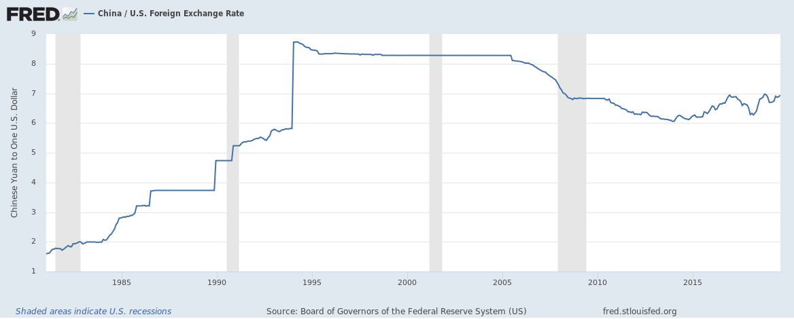

# 常用数据来源

[在哪里能找到各行业的分析研究报告？](https://www.zhihu.com/question/19766160)

《中国统计年鉴》

- http://www.stats.gov.cn/tjsj/ndsj/

《中国劳动统计年鉴》

- 知网搜相关条目，如「城镇按行业、性别分的就业人员调查周平均工作时间」
- 2016 年： http://www.mohrss.gov.cn/2016/indexch.htm

国家统计局总结报告

- [2019年国民经济运行总体平稳 发展主要预期目标较好实现](http://www.stats.gov.cn/tjsj/zxfb/202001/t20200117_1723383.html)

# 世界建模用数字数字

## 地理与行政区划

34个省级行政区，23个省，2特别行政区，4直辖市，5自治区，简记为 2334 56（特市=4+2=6也）

## 人口

2019年末中国人口：十四亿零五万人，约十四亿人。（http://www.stats.gov.cn/tjsj/zxfb/202001/t20200117_1723383.html）

## 生产总值、可支配收入

https://en.wikipedia.org/wiki/List_of_countries_by_GDP_(nominal)

https://en.wikipedia.org/wiki/List_of_countries_by_GDP_(nominal)_per_capita

https://en.wikipedia.org/wiki/List_of_countries_by_GDP_(PPP)

https://en.wikipedia.org/wiki/List_of_countries_by_GDP_(PPP)_per_capita

## 自然资源

### 森林

森林面积：https://en.wikipedia.org/wiki/List_of_countries_by_forest_area

中国，1990 约 150 万平方公里，2010 约 200 万平方公里。2020 约 2.1 亿公顷（公顷=平方百米=0.01 平方千米）。

## 实物产量

### 汽车

上汽集团发布2019年12月份产销快报，单月产量61.16万辆，同比下降2.88%；销量69.77万辆，同比增长5.76%。全年累计产量615.19万辆，同比下降11.84%；累计销量623.8辆，同比下降11.54%。没有达成上汽集团此前调整后的650万辆的年度销售目标。

## 汇率

### 美元兑人民币

（https://commons.wikimedia.org/wiki/Category:Renminbi_exchange_rate_charts）

20200511：1美元=7.0909人民币

简记为7

盖自我出生高于8，2007附近降至7，2014附近降至6，今回并在2019年8月成功「破7」。世人关注「破7」

### 欧元兑人民币

https://commons.wikimedia.org/wiki/File:CNY-EUR_1999-.svg

20200511：1欧元=7.6662人民币；1人民币 ≈ 0.1304欧元

简记为7.5

### 人民币兑日元

https://commons.wikimedia.org/wiki/File:JPY-CNY_v2.svg

20200511：1日元=0.06593人民币；1人民币 ≈ 15.1683日元

简记为15

### 英镑兑人民币

20200511：1英镑=8.7466人民币；1人民币 ≈ 0.1143英镑

简记为9

### 美元兑日元

https://commons.wikimedia.org/wiki/File:USD_rate_to_JPY.svg

20200511：1美元=107.61日元；1日元 ≈ 0.0093美元

简记为7*15

# 其他权威资料来源

[2019年非上海生源应届普通高校毕业生进沪就业申请本市户籍评分办法](http://www.firstjob.com.cn/folder76/folder79/2019-07-26/4584.html)

- 上外对落沪的说明（https://career.shisu.edu.cn/2019/05/07/19050713575734223.html），指向上海学生就业创业服务网（www.firstjob.com.cn,以下简称“就业创业服务网”）