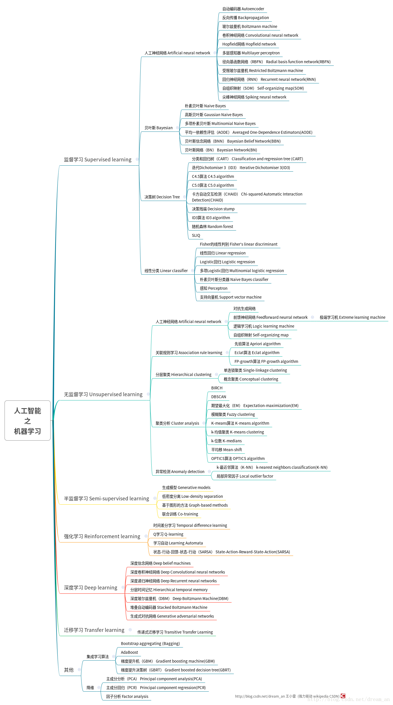

框架暂时参考吴恩达。

另一个框架：[第一章人工智能之机器学习算法体系汇总——王小雷](https://blog.csdn.net/dream_an/article/details/76358374)

# 第一课 绪论 Intrduction

- 欢迎
    - 机学诞生于 AI 研究，是计算机的新能力
    - 例
        - 数据库挖掘：web click data, medical records, biology, engineering
        - 无法手动编程的应用：autonomous helicopter, handwriting recognition, most of NLP, CV
        - self-customizing 程序: Amazon, Netflix 产品推荐
        - 理解人类学习（brain, real AI）
- 机学是啥
    - 定义
        - Arthur Samuel, 1959: 使计机有能力不显式编程而学习
        - Tom Mitchell, 1998: 对任务T，从经验E中学习，效果以P衡量且随着E而提高
            - *给案例识别其T、E、P*
    - 算法分类：有监督、无监督、强化（reinforcement learning）、recommender systems
- 有监督学习：已知“正确答案”
    - `回归`（regression）：输出为连续值
    - `分类`（classification）：输出为离散值
- 无监督学习：自己聚类

# 第二课 单元线性回归 Linear regression with one variable, univariate linear regression

- 模型表示
    - 训练は训练集→学习算法→h；预测は自变量→h→因变量的估计值
        - hはhypothesis，*就是「模型」叭*
    - 表示h的方法：线性函数 $h_θ(x)=θ_0+θ_1x$，简记 $h(x)$
        - θは参数（parameters）
- 损失函数
    - 平方差函数也
        - $J(θ_0, θ_1) = \frac{1}{2m}  Σ_{i=1}^m ( h_θ(x^{(i)}) - y^{(i)} )^2$
        - 输入参数，输出是一个损失值
    - 求θ0,θ1使J最小
- 损失函数直觉
    - 二元函数画出来，等高线图一看，bowl shape
- 梯度下降
    - 从初始θ不断改θ以减J
    - 梯度下降算法
        - 直到收敛：$θ_j:=θ_j - α \frac{∂}{∂θ_j}J(θ_0, θ_1)$ 对每个$θ_j$
        - 注意，应该同时更新每一个θ，不要让更新后的θj影响θj+1的求值
        - αは学习率
- 梯度下降直觉
    - 梯度是增长方向，负号取下降方向
    - α小则慢，大则超调以致发散
    - 收敛到局部最小值
        - 单元线性回归是 convex的，所以会到全局最优
    - α可以取定，因为越接近目标，导数越小，自会收敛
- 梯度下降用于线性回归
    - 对于线性，θ_0, θ_1，简单求导得：（同时更新）
        - $θ_0:=θ_0 - α  \frac{1}{m}  Σ_{i=1}^m ( h_θ(x^{(i)}) - y^{(i)} )$
        - $θ_1:=θ_1 - α  \frac{1}{m}  Σ_{i=1}^m ( h_θ(x^{(i)}) - y^{(i)} )·x^{(i)}$
    - 批量梯度下降（"batch" GD）：每步使用所有训练样本，也就是那个Σ

# 第三课 线代 Linear Algebra review (optional)

- 矩阵和向量
- 加法と数乘
- 矩阵向量点乘
- 两矩阵点乘：右者相当于俩向量并排
- 点乘性质：不满足交换律；单位矩阵随便左右乘；
- 逆과转置
    - 逆：左或右乘原都等于单位阵
- 求和号转向量乘：求和的两个乘数为俩向量。

# 第四课 多元线性回归 Linear Regression with multiple variables

- 多重特征
    - $h_θ(x) = θ_0 + θ_1x_1 + θ_2x_2 + ... + θ_nx_n  \\  = \pmb{θ}^T \pmb{x}$
        - 为了公式好写，新设 $x_0 = 1$
- 多元梯度下降
    - $J(\pmb{θ})$
    - 每个θj的更新变成 $θ_j:=θ_j - α  \frac{1}{m}  Σ_{i=1}^m ( h_θ(x^{(i)}) - y^{(i)} )·x^{(i)}_j$
- 梯度下降实践1——特征缩放
    - 缩放：使特征在相似的scale，约 $-1≤x≤1$
    - 均值归一化（mean normalization）：都减去均值μj再缩放
    - $x_j = \frac{x_j-μ_j}{s_j}$，μ是这个变量在训练集的avg，s是max-min或标准差
- 梯度下降实践2——学习率
    - 每次迭代J(θ)应下降
    - 自动测敛：J(θ)一代下降幅度小于ε（如1e-3）
    - α太小收敛慢，太大可能不收敛或收敛慢
    - 试选 0.001、0.003、0.01、0.03、0.1、0.3、1……
- 特征和多项式回归
    - 把特征的幂当成新特征。根据点分布情况选幂次。
- 正规方程（法方程，normal equation）
    - 正规方程は解析解也
    - 多个样本写一起，一行一个样本，$\pmb{Xθ=y}$
        - （还是别忘了x0=1）
        - 为了可逆而乘$X^T$，然后再于是
        - $\pmb{θ=(X^T X)^{-1} X^T y}$
    - 不需要归一化
    - 梯度下降乄正规方程
        - GD要选学习率，要迭代
        - 正规方程要算n×n的逆，O(n^3)，n很大时很慢而GD依然高举
- 正规方程与不可逆性（选学）（normal equation and non-­invertibility）
    - 若不可逆，Octave可用pinv()
    - 不可逆通常意味着冗余特征（线性相关）、太多特征（如m≤n）（应删掉一些，或用正则化（rugularization））

# 第五课 Octave 教程 Octave Tutorial

- 基本运算
- Moving data around
- Computing on data
- Plotting data
- Control statements: for, while, if statements
- Vectorial implementation

# 第六课 对数几率回归（Logistic Regression）

- 分类
    - 简单用0、1表示结果而套线性回归，是不行的，结果被0、1数据的不均匀性拉偏
    - `对数几率回归`：其实是为了分类；$0≤h_θ(x)≤1$
- 假设表示
    - `对数几率函数`（丝型函数、S型函数）： $g(z)= 1 / (1+e^{-z})$，以使结果 0~1
    - 假设函数： $h_θ(x)=g(θ^T x)$，推测 y=1 的概率 $即 =P(y=1 | x ; θ)$
- 决策边界
    - 对率函数图像知，假设函数≥0.5条件是$θ^T x≥0$；因而$θ^T x=0$即边界
    - 线性边界，非线性边界（引入非线性特征）
- 惩罚函数
    - 误差值：y=1 时 $-log(h_θ(x))$，y=0时 $-log(1-h_θ(x))$
        - 理解：对数函数上下翻转满足0-1内越1越小而在0极大故用作y=1时的
        - 俩条件合一起写：$-ylog(h_θ(x))-(1-y)log(1-h_θ(x))$
    - 惩罚函数：$J(θ) = -1/m Σ_{i=1}^m Cost(h_θ(x),y) \\ = -1/m Σ_{i=1}^m y^{(i)}log(h_θ(x^{(i)}))+(1-y^{(i)})log(1-h_θ(x^{(i)}))$
- 梯度下降：$θ_j := θ_j - α \frac{∂}{∂θ_j} J(θ)  \\ := θ_j - α Σ_{i=1}^m ( h_θ(x^{(i)})- y^{(i)} ) x_j^{(i)}$
- 高级优化
    - 各种优化算法：梯度下降、共轭梯度（conjugate gradient）、BFGS、L-BFGS
        - 梯度下降之外算法的优点は不用手动选α、一般更快，缺点は更复杂
- 多类别分类——一对全（one-vs-all）或称一对余（one-vs-rest）
    - 每类一个预测函数，表示结果是此类的概率；预测时选概率最大的那个类

# 第七课 过拟合&正则化 Regularization

# 第八课 神经网络之表示 Neural Networks: Representation

# 第九课 神经网络之学习 Neural Networks: Learning

# 第十课 机器学习应用建议 Advice for applying machine learning

# 第十一课 机器学习系统设计 Machine learning system design

# 第十二课 支持向量机 Support Vector Machines

有监督学习之线性分类之：线性回归、对数几率回归、多元对数几率回归、感知机（perceptron）、朴素贝叶斯分类器、Fisher线性判别（Fisher's linear discriminant）（又叫 LDA，Linear Discriminant Analysis）、支持向量机（SVM）

- 支持向量机的正则化系数常用给第一项的C，而不是第二项的λ，其实C相当于1/λ
    - C很大，会极大惩罚错判点，让SVM受异常点影响很大
    - 所以，当欠拟合，想减少bias，增大variance，则是增大C，相当于减少λ
        - 亦，减小高斯核函数的σ²
- 核函数
    - 高斯核函数
        - `sim = exp( -sum((x1-x2).*(x1-x2)) /2/sigma/sigma);`
        - σ² 大，则比较平，因为不到很大都是和中间的0近似
        - **SVM中使用高斯核函数之前通常会进行特征归一化**
            - The similarity measure used by the Gaussian kernel expects that the data lie in approximately the same range
            - 因为取的勾股距离吧
        - The Gaussian kernel is also parameterized by a bandwidth parameter, σ, which determines how fast the similarity metric decreases (to 0) as the examples are further apart

# 第十三课 聚类 Clustering

无监督学习：

- 聚类：K均值、EM（期望最大化，Expectation-maximization）、KNN（K近邻）
    - K-means
        - 损失函数（distortion function）
            - A lower value for the distortion function implies a better clustering, so you should choose the clustering with the smallest value for the distortion function. 
            - 损失函数不可能有时上升
            - 所有点，到类心点的距离，的平方和的平均值 
        - 随机初始化
            - 选取K后，随机选择K个样本初始。重复「指定类心点」「移动类心点」。
            - 上述过程重复i次，取损失函数最小的那次作为结果，防止局部最优
        - 选择聚类数K：
            - 肘形曲线
            - 看实际需求
- 异常检测：局部异常因子（local outlier factor）
- 关联分析：先验算法（apriori）、频繁模式增长（FP-growth，Frequent Pattern Growth）、等价类变换算法（Eclat算法，Equivalence CLAss Transformation）

# 第十四课 降维 Dimensionality Reduction

- 应用：数据压缩
- 应用：可视化（一般就能图形化表示二维、三维）
- 主成分分析（PCA, Principal Component Analysis）
    - 目标：投影误差を最小化
        - 作为对比，线性回归最小化的是y方向的误差
    - 计算过程
        - 先归一化：缩放、减均
        - covariance matrix `sigma = 1/m * X' * X`
            - 就是列向量乘其转置，出来 nxn向量
        - eigenvectors ofth matrix
            - `U, S, V = svd(sigma)`
                - singular value decompositio，奇异值分解
                - svd函数也可能叫eig
                - Uは左奇异矩阵，V^Tは右，Sは奇异值（只在对角线有值）
            - 即。求出协方差矩阵的特征值及对应的特征向量。特征向量最能代表原始数据。
        - `Ureduce = U(:, 1:k)`
            - 即，将特征向量按对应特征值大小从上到下按行排列成矩阵，取前k行组成矩阵Ur。（找k个最能代表原数据的向量）
        - `z = (Ureduce' * x)`
    - 使用细节
        - 重建压缩后的数据（近似）
        - 选择主成分数量
            - 衡量：比值 of 平均平方映射误差 et 数据的总变差 (Total Variation) （它的意思是 “平均来看 我的训练样本 距离零向量多远？）
            - e.g. Choose k to be the smallest value so that at least 99% of the variance is retained.
            - 用svd返回的S矩阵可以简便计算
    - 应用建议
        - 应用场景
        - 不建议的场景
            - Preventing overfitting: Reduce the number of features (in a supervised learning problem), so that there are fewer parameters to learn.

# 第十五课 检测异常 Anomaly detection

- 与有监督学习的主要区别是，正（异常）样本数很小

# 第十六课 推荐系统 Recommender Systems

# 第十七课 大规模机器学习 Large scale machine learning

随机梯度下降（stochastic gradient descent）、小批量梯度下降（mini-batch gradient descent）、随机梯度下降收敛、在线学习（online learning）、映射规约和数据并行（map-reduce and daata parallelism）

- 在线学习
    - 每次使用一个例子，使用完丢弃再也不使用
    - 可以适用于变化中的用户偏好

# 第十八课 应用案例——图片光字识 Application example: Photo OCR

# 符号声明

symbo | meani
-|-
$m$ | 训练样例数
$x$ | 输入变量/特征
$y$ | 输出变量/目标变量
$(x^{(i)}, y^{(i)})$ | 第i个训练样例
$n$ | 特征数
$x_j^{(i)}$ | 特征j在样本i的值

# noten vom ML DNg

https://blog.csdn.net/u012052268/article/details/78816779
（ https://blog.csdn.net/u012052268/category_9270840.html ）

# 杂散

- 文本处理
    - typo correction
        - `symspell`
    - 词干化（stemming）
        - `PorterStemmer`
    - 词云
        - `WordCloud`
- LDA（Latent Dirichlet Allocation，隐含狄利克雷分布）：用于主题分类
    - 《LDA数学八卦》などを参考して
        - [LDA-math-神奇的Gamma函数(1)](https://www.52nlp.cn/lda-math-%e7%a5%9e%e5%a5%87%e7%9a%84gamma%e5%87%bd%e6%95%b01)
        - [概率语言模型及其变形系列-LDA及Gibbs Sampling](https://www.52nlp.cn/%e6%a6%82%e7%8e%87%e8%af%ad%e8%a8%80%e6%a8%a1%e5%9e%8b%e5%8f%8a%e5%85%b6%e5%8f%98%e5%bd%a2%e7%b3%bb%e5%88%97-lda%e5%8f%8agibbs-sampling)
        - [一文详解LDA主题模型](https://zhuanlan.zhihu.com/p/31470216)
        - [The Hitchhiker's Guide to LDA](https://arxiv.org/abs/1908.03142)
- 聚类
    - 评价指标
        - silhouette_score：所有样本的轮廓系数的平均值
        - coherence score
- 可视化
    - UMAP（Uniform Manifold Approximation and Projection，统一流形近似与投影），用于可视化或非线性降维
    - t-SNE：比 UMAP 更经典的可视化
- 词向量句向量
    - [bert-as-service](https://github.com/hanxiao/bert-as-service)
    - [Familia](https://github.com/baidu/Familia/wiki)
    - [sentence-transformers](https://github.com/UKPLab/sentence-transformers)
    - [gensim: Topic modelling for humans](https://radimrehurek.com/gensim/)
    - [Topic Modeling BERT+LDA](https://www.kaggle.com/dskswu/topic-modeling-bert-lda#)
- 训练
    - iteration 是用 批容量 个样本训练一次，而 epoch 是全部样本都来了一遍。是以，`475(= 7595*10 / per_gpu_train_batch_size / n_gpus)` 个iter每epoch 于 7595×10 个训练样本，`per_gpu_train_batch_size` 的批容量每图处元，共 `n_gpus` 个图处元。（所有gpu都运行了自己的批，叫一个iter）